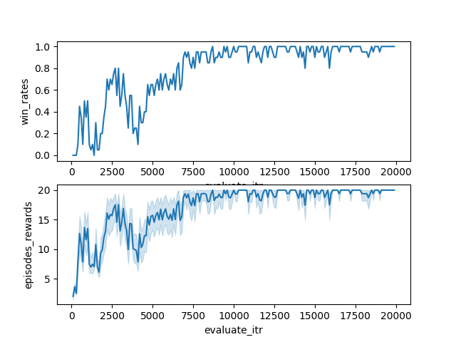
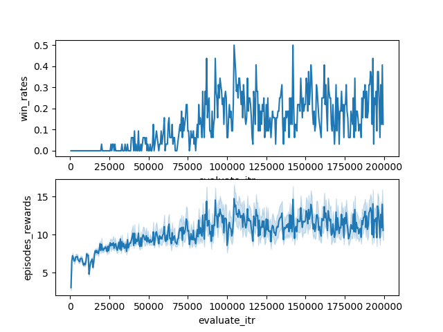
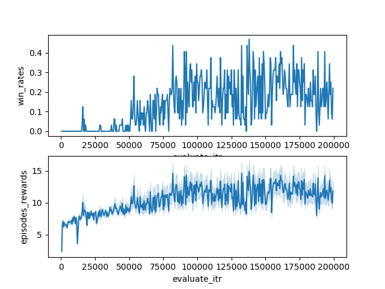

# torchMARL

主要是一些MARL算法的pytorch实现，目前包括：
[VDN](https://arxiv.org/abs/1706.05296), [QMIX](https://arxiv.org/abs/1803.11485), [Weighted QMIX(CW-QMIX, OW-QMIX)](https://arxiv.org/abs/2006.10800)

该项目基于 https://github.com/starry-sky6688/StarCraft 改进得到，简化了模块与算法流程，改进可视化，方便建立自己的算法库。

网络参数设置与“The StarCraft Multi-Agent Challenge”（[SMAC](https://arxiv.org/abs/1902.04043)）中保持一致。

目前在StarCraft II上进行测试，但可以方便地迁移到任意封装好的环境使用。

相关资料：[Pymarl](https://github.com/oxwhirl/pymarl)

## Corresponding Papers

- [QMIX: Monotonic Value Function Factorisation for Deep Multi-Agent Reinforcement Learning](https://arxiv.org/abs/1803.11485)
- [Value-Decomposition Networks For Cooperative Multi-Agent Learning](https://arxiv.org/abs/1706.05296)
- [Counterfactual Multi-Agent Policy Gradients](https://arxiv.org/abs/1705.08926)
- [QTRAN: Learning to Factorize with Transformation for Cooperative Multi-Agent Reinforcement Learning](https://arxiv.org/abs/1905.05408)
- [Learning Multiagent Communication with Backpropagation](https://arxiv.org/abs/1605.07736)
- [From Few to More: Large-scale Dynamic Multiagent Curriculum Learning](https://arxiv.org/abs/1909.02790?context=cs.MA)
- [Multi-Agent Game Abstraction via Graph Attention Neural Network](https://arxiv.org/abs/1911.10715)
- [MAVEN: Multi-Agent Variational Exploration](https://arxiv.org/abs/1910.07483)
- [Weighted QMIX: Expanding Monotonic Value Function Factorisation](https://arxiv.org/abs/2006.10800)
- [The StarCraft Multi-Agent Challenge](https://arxiv.org/abs/1902.04043)

## Installation

- Python $\geq$ 3.6
- Pytorch $\geq$ 1.2
- SMAC
- Seaborn $\geq$ 0.9

对于SMAC，这里简单介绍一下linux下的安装，Windows等系统可以查看[他们的仓库](https://github.com/oxwhirl/smac)。

1. 通过下列命令安装SMAC

   `pip install git+https://github.com/oxwhirl/smac.git`

2. 安装StarCraft II，这里给出 [4.6.2](http://blzdistsc2-a.akamaihd.net/Linux/SC2.4.6.2.69232.zip) 的下载链接，因为SMAC用的就是这个，并且他说不同版本之间不能比较，其余版本可以查看[暴雪的仓库](https://github.com/Blizzard/s2client-proto)，解压时需要密码`iagreetotheeula`。解压后文件默认路径为`~/StarCraftII/`，如果放在别的路径，需要更改环境变量`SC2PATH`

3. 下载[SMAC MAPS](https://github.com/oxwhirl/smac/releases/download/v0.1-beta1/SMAC_Maps.zip)，解压后将文件夹直接放在`$SC2PATH/Maps`下即可

4. 运行`python -m smac.bin.map_list `测试地图是否放置成功，运行`python -m smac.examples.random_agents`测试安装是否成功。如果是centos的话可能会出现因为缺少对应版本依赖`/home/user/SMAC/StarCraftII/Versions/Base75689/SC2_x64: /lib64/libc.so.6: version 'GLIBC_2.18' not found (required by /home/user/SMAC/StarCraftII/Libs/libstdc++.so.6)`而导致`pysc2.lib.remote_controller.ConnectError: Failed to connect to the SC2 websocket. Is it up?`，这时候就要根据情况安装依赖或者使用docker了。


## TODO List

- [ ] Qatten
- [ ] Other SOTA MARL algorithms
- [ ] Update results on other maps

## Usage

```shell
$ python main.py --map=3m --alg=qmix
```

或者直接pycharm打开项目，run main.py即可，也可以使用run.sh复现QMIX、CW-QMIX、OW-QMIX在5m_vs_6m上的实验。

SMAC的各种地图描述在这里：https://github.com/oxwhirl/smac/blob/master/docs/smac.md

## Results

暂时只贴一部分，因为我目前主要实现值分解的算法。所有地图的环境设置均与SMAC相同，难度为7（VeryHard）

### 3m

<center> <figure> 
    
     
</figure> </center>

<center>VDN, QMIX</center>

### 5m_vs_6m

<center> <figure> 
    
     
     
</figure> </center>

<center>QMIX, CW-QMIX, OW-QMIX</center>

## Replay

If you want to see the replay, make sure the `replay_dir` is an absolute path, which can be set in `./common/arguments.py`. Then the replays of each evaluation will be saved, you can find them in your path.
