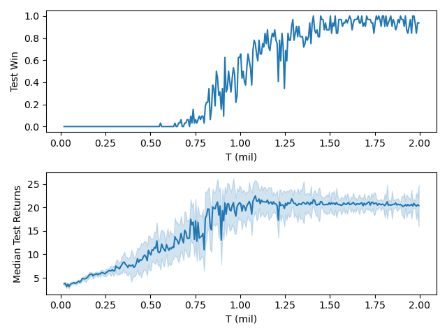
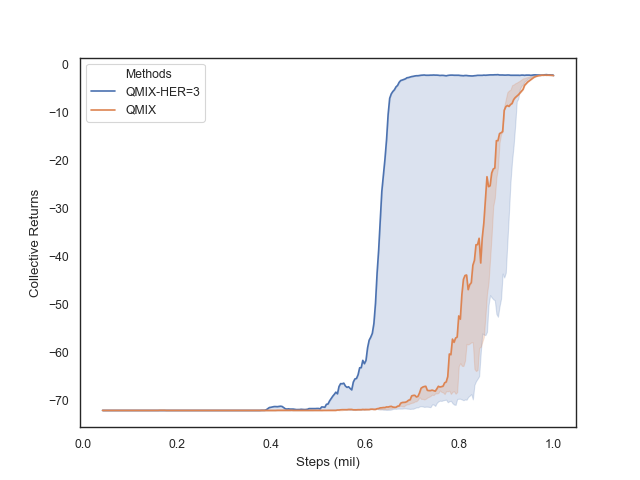
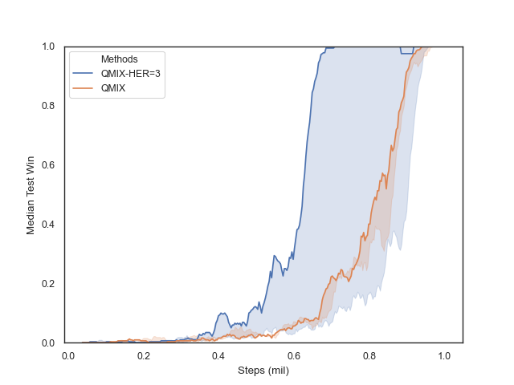

# torchMARL
**English | [简体中文](README.cn.md)**

This project is mainly the pytorch implementation of some MARL algorithms, currently including: [VDN](https://arxiv.org/abs/1706.05296), [QMIX](https://arxiv.org/abs/1803.11485), [QTRAN](https://arxiv.org/abs/1905.05408), [Qatten](https://arxiv.org/abs/2002.03939), [Weighted QMIX(CW-QMIX, OW-QMIX)](https://arxiv.org/abs/2006.10800), [QPLEX](https://arxiv.org/abs/2008.01062).

Based on some existing implementation ([Pymarl](https://github.com/oxwhirl/pymarl), [StarCraft](https://github.com/starry-sky6688/StarCraft), [QPLEX](https://github.com/wjh720/QPLEX)), the project simplifies the module and algorithm flow, improves visualization, and facilitates the establishment of your own algorithm library. 

The hyper-parameters of these algorithms are the same as that in [SMAC](https://arxiv.org/abs/1902.04043) and referred in their source codes.

It has been tested on StarCraft II, but can be conveniently applied to any SMAC-like environments.

`./envs` includes some didactic environments used in QPLEX and an extra multi-goal environment: go_orderly. go_orderly generates a set of goals at the begin of a episode, and agents get rewards when they reach the corresponding goals. It's used for verifying the improvement like [Hindsight Experience Replay](https://arxiv.org/abs/1707.01495).

## Installation

- Python >= 3.6
- Pytorch >= 1.2
- SMAC
- Seaborn >= 0.9

For SMAC, here is a brief introduction to the installation under linux, Windows and other systems can refer to [their repository](https://github.com/oxwhirl/smac).

1. Run the following command to install SMAC

   `pip install git+https://github.com/oxwhirl/smac.git`

2. For StarCraft II installation, here is the link of [4.6.2](http://blzdistsc2-a.akamaihd.net/Linux/SC2.4.6.2.69232.zip), which is used by smac and they said performance is not always comparable between versions. Other versions can be found in [Blizzard's repository](https://github.com/Blizzard/s2client-proto). Password `iagreetotheeula` is required for decompression. The default path is `~/StarCraftII/`. You can specify the path by modifying `SC2PATH`.

3. Download [SMAC MAPS](https://github.com/oxwhirl/smac/releases/download/v0.1-beta1/SMAC_Maps.zip), move it to `$SC2PATH/Maps` after decompression.

4. Run `python -m smac.bin.map_list ` to see the list of SMAC map. Run `python -m smac.examples.random_agents` to make sure that smac and its maps are properly installed.

## Usage

Run the following command to experiment QMIX on 3s5z_vs_3s6z:

```shell
$ python -u main.py --map='3s5z_vs_3s6z' --alg='qmix' --max_steps=2000000 --epsilon_anneal_steps=50000 --num=5 --gpu='0'
```

Or open the project by IDE and run main.py.

Run run.sh to reproduce experiments on go_orderly.

You can find the description of SMAC maps at https://github.com/oxwhirl/smac/blob/master/docs/smac.md

## Results

The experiment settings of all maps are the same as SMAC, and the difficulty is 7 (VeryHard)

Some pictures in `./imgs` are the results of the former version.

### 3s_vs_5z QMIX



### go_orderly

|  |  |
| :------------------------------------------------: | :-------------------------------------------------: |
|            Returns           |            Win Rates             |


## Replay

If you want to see the replay, make sure the `replay_dir` is an absolute path, which can be set in `./common/arguments.py`. Then the replays of each evaluation will be saved, you can find them in your path.